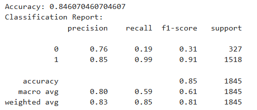
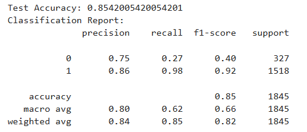

# StyleSense: Fashion Forward Forecasting


StyleSense is a rapidly growing online women's clothing retailer known for its trendy and affordable fashion. With the influx of new customers, a backlog of product reviews with missing data has emerged. Customers often provide detailed textual feedback but do not always indicate whether they recommend the product.

This project aims to build a predictive model using machine learning and natural language processing (NLP) to determine whether a customer would recommend a product based on review text, customer demographics, product category, and other relevant factors. Automating this process will help StyleSense analyze customer satisfaction, identify trending products, and enhance the shopping experience.

## Getting Started

1. Clone the Repository: <br>
git clone https://github.com/JKalthoom/dsnd-pipelines-project/ <br>
2. Set Up a Virtual Environment: <br>
3. Install Dependencies: <br>
pip install -r requirements.txt
4. Download and Prepare the Dataset: <br>
Ensure that the dataset is available in the data/ folder.
5. Run the code from the starter.ipynb file


### Dependencies

```
Python 3.8+ - Core language for the project.
Jupyter Notebook - For exploratory data analysis.
pandas - Data manipulation.
numpy - Numerical computing.
scikit-learn - Machine learning models and preprocessing.
spaCy - Natural language processing.
matplotlib & seaborn - Data visualization.
```

### Installation

1. Ensure Python 3.8+ is installed.
2. Clone the repository.
3. Set up a virtual environment.
4. Install dependencies using pip install -r requirements.txt


### Testing

The model's performance was evaluated using accuracy, precision, recall, and F1-score. Below are the classification reports from the tests: <br>

**Note**: Due to memory limitations on my PC, I used HalvingRandomSearchCV instead of traditional hyperparameter tuning methods. While this helped optimize the model efficiently within available resources, the accuracy did not improve significantly. <br>

Test Results 1 (Before fine-tuning): <br>


Test Results 2 (After fine-tuning): <br>


### Breakdown of Tests

- Precision: Measures how many predicted positive labels were actually correct.
- Recall: Measures how many actual positive labels were correctly predicted.
- F1-score: Harmonic mean of precision and recall, providing a balance between the two.
- Support: Number of occurrences of each class in the test set.
- Accuracy: Overall correct predictions divided by total samples.

The results indicate strong performance for class 1 (recommendation), while class 0 (no recommendation) has lower recall. This suggests the model is better at identifying recommendations but may miss some non-recommendations.

## Project Instructions

The student deliverables for this project include: <br>
- Data preprocessing (cleaning and feature engineering)
- Exploratory data analysis (EDA)
- Model training, evaluation, and hyperparameter tuning
- Model deployment (if applicable)

## Built With

* [Python](https://www.python.org/) - Primary programming language.
* [Scikit-learn](https://scikit-learn.org/stable/) - Machine learning algorithms.
* [SpaCy](https://spacy.io/) - NLP processing.
* [Pandas](https://pandas.pydata.org/) - Data manipulation and analysis.
* [Numpy](https://numpy.org/) - Data manipulation and analysis.
* [Matplotlib](https://matplotlib.org/) - Data visualization.
* [Seaborn](https://seaborn.pydata.org/) - Data visualization.

## License

This project is licensed under the MIT License - see the LICENSE file for details.
